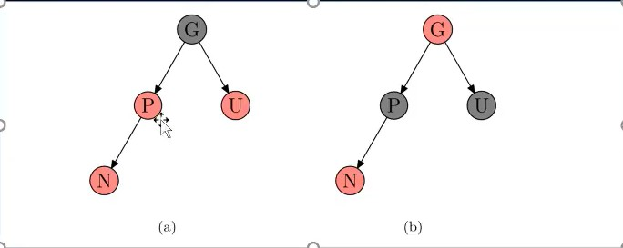
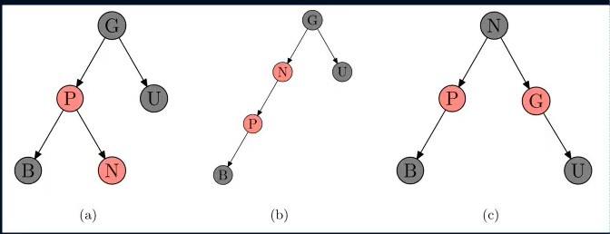

## 情况一:

- 新节点 N 位于树的根上 没有父节点 ,**将红色变为黑色**即可

## 情况二:

- 新节点的父节点是 P 是黑色 , **直接插入**

## 情况三:

- 新节点的父亲节点 P 和 叔叔节点 U 都是红色 , **将 G 变成红 P U 变成黑**

## 情况四

- **将 P 和 G 颜色对调,以 P 为根节点,进行右旋转**

## 情况五

- **以 P 为根节点进行左旋转,再将 P 作为新节点进行情况四处理**
